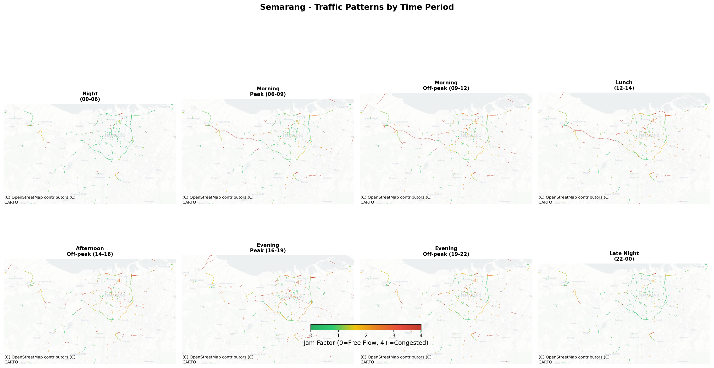
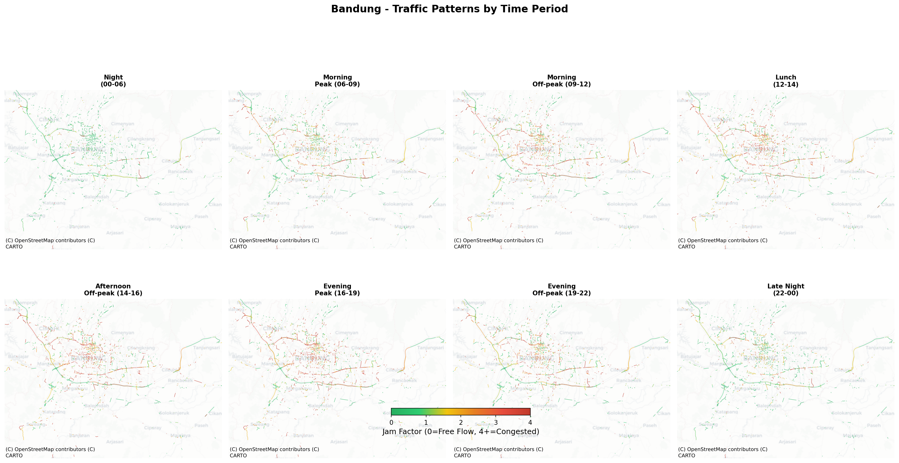
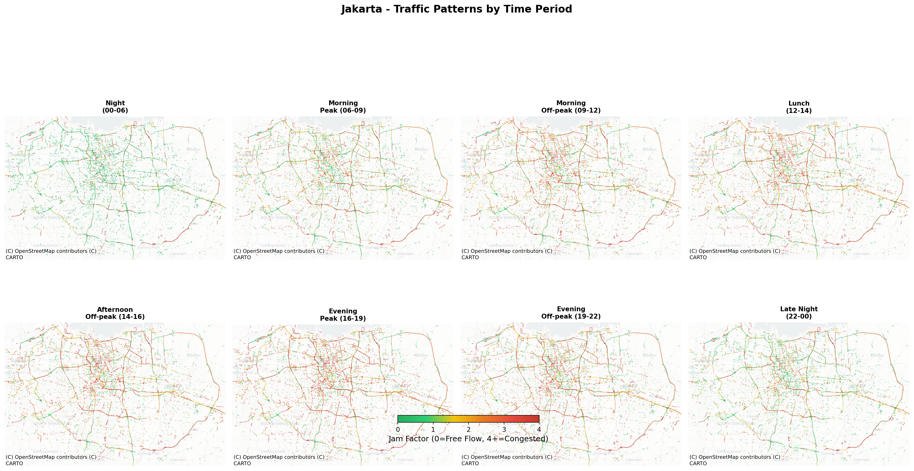
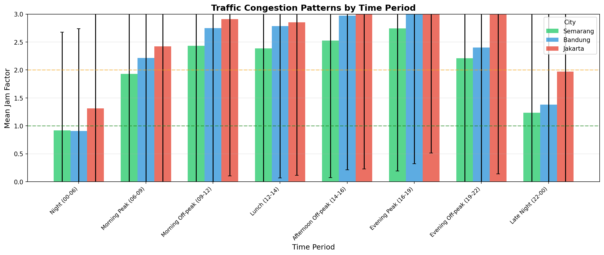
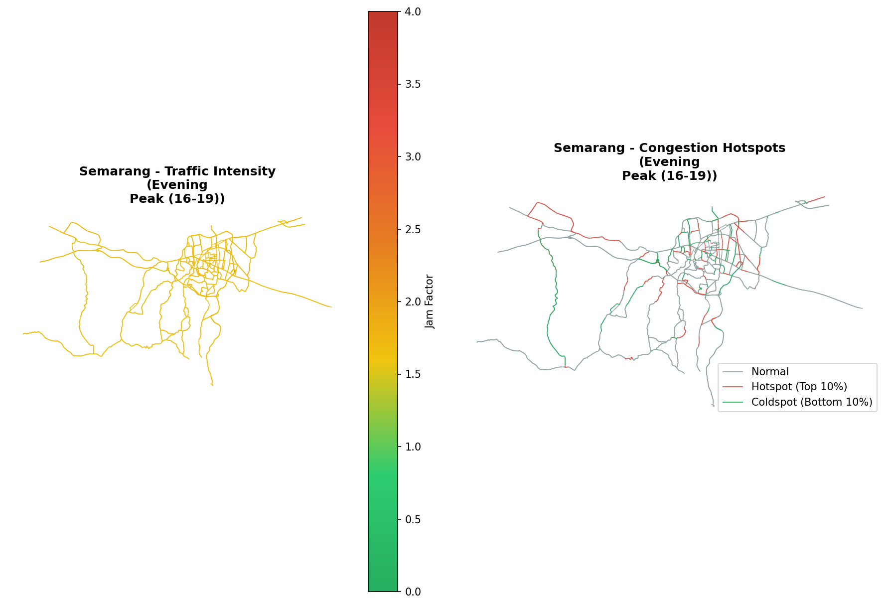
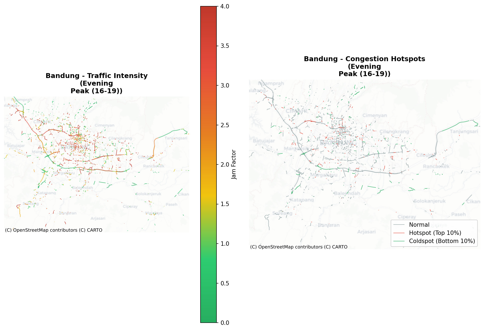
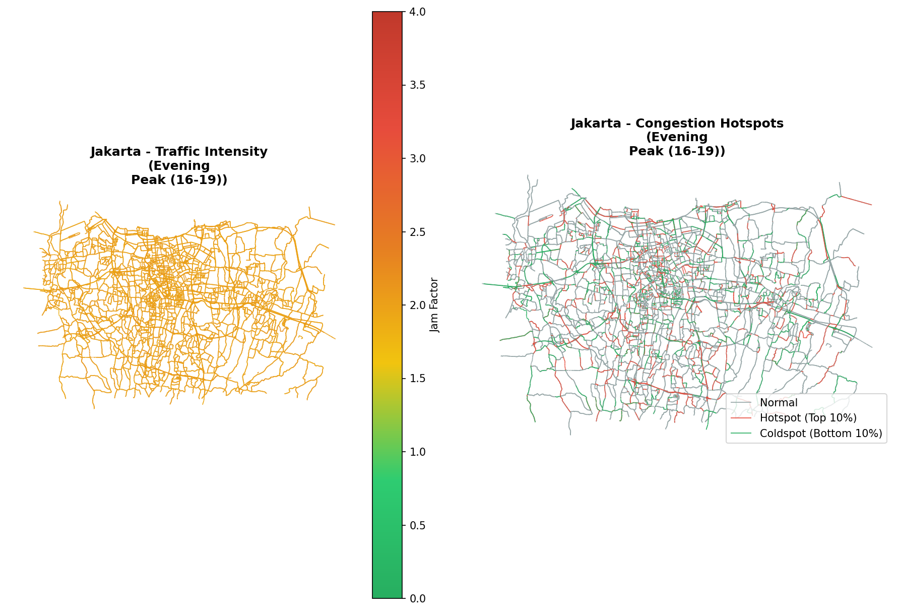

# Traffic Congestion Pipeline

[](https://pypi.org/project/traffic-congestion-pipeline/)
[](https://github.com/firmanhadi21/traffic-analyses/actions/workflows/test.yml)
[](LICENSE)
[](https://www.python.org/)
[](https://firmanhadi21.github.io/traffic-analyses/)

An **open-source, pure-Python pipeline** for spatiotemporal traffic congestion analysis, integrating commercial traffic flow APIs (HERE, TomTom, Google), OSMnx, and PySAL. Designed for reproducible, provider-agnostic urban analytics across Indonesian metropolitan cities (**Semarang**, **Bandung**, **Jakarta**).

## Overview

This system collects traffic data at 15-minute intervals and processes it into time-period aggregated statistics. The data spans from **March 2025 to February 2026**, providing a full year of traffic patterns for urban planning and transportation research.

### Cities Covered

| City | Segments | Bounding Box | Coverage |
|------|----------|--------------|----------|
| Semarang | 1,076 | 110.227-110.528, -7.105 to -6.919 | Urban core |
| Bandung | 3,069 | 107.469-107.826, -7.085 to -6.829 | Metropolitan area |
| Jakarta | 14,549 | 106.604-107.110, -6.410 to -6.091 | Greater Jakarta |

## Data Summary

| City | Files Processed | Total Records | Date Range |
|------|-----------------|---------------|------------|
| Semarang | 14,122 | 15.2 million | Mar 2025 - Feb 2026 |
| Bandung | 14,136 | 43.4 million | Mar 2025 - Feb 2026 |
| Jakarta | 14,132 | 206.3 million | Mar 2025 - Feb 2026 |

## Time Periods

Data is aggregated into 8 distinct time periods:

| Period | Time Range | Description |
|--------|------------|-------------|
| `night` | 00:00 - 06:00 | Night hours |
| `morning_peak` | 06:00 - 09:00 | Morning rush hour |
| `morning_offpeak` | 09:00 - 12:00 | Late morning |
| `lunch_hours` | 12:00 - 14:00 | Midday |
| `afternoon_offpeak` | 14:00 - 16:00 | Early afternoon |
| `evening_peak` | 16:00 - 19:00 | Evening rush hour |
| `evening_offpeak` | 19:00 - 22:00 | Evening |
| `late_night` | 22:00 - 00:00 | Late night |

## Repository Structure

```
traffic-analyses/
├── pyproject.toml               # Package build & dependency spec
├── LICENSE                      # MIT License
├── README.md
│
├── src/trafficpipeline/         # Installable Python package
│   ├── __init__.py
│   ├── config.py                # Centralized city/period/constant definitions
│   ├── utils.py                 # Timestamp extraction, geometry hashing, filters
│   ├── aggregate.py             # Raw GeoPackage → time-period aggregation
│   ├── eda.py                   # Data validation & exploratory analysis
│   ├── geostatistics.py         # Spatial statistics & hot-spot analysis
│   ├── bottleneck.py            # Road-capacity bottleneck analysis (OSMnx)
│   ├── poi.py                   # POI-congestion density analysis
│   ├── synthesis.py             # Temporal vs spatial predictor comparison
│   ├── collector.py             # Multi-provider traffic data collector
│   └── cli.py                   # Click CLI entry point
│
├── traffic_collector.py         # Standalone collection script (daemon/cron)
├── com.trafficpipeline.collector.plist  # macOS launchd service
│
├── # Legacy standalone scripts (superseded by package)
├── run_semarang_aggregation.py
├── run_bandung_aggregation.py
├── run_jakarta_aggregation.py
├── geostatistical_analysis.py
├── exploratory_data_analysis.py
├── bottleneck_analysis.py
├── poi_congestion_analysis.py
├── temporal_vs_spatial_comparison.py
│
├── # Output Data (GeoPackage format)
├── traffic_smg_output/          # Semarang aggregated data
│   ├── night_smg.gpkg
│   ├── morning_peak_smg.gpkg
│   ├── morning_offpeak_smg.gpkg
│   ├── lunch_hours_smg.gpkg
│   ├── afternoon_offpeak_smg.gpkg
│   ├── evening_peak_smg.gpkg
│   ├── evening_offpeak_smg.gpkg
│   └── late_night_smg.gpkg
├── traffic_bdg_output/          # Bandung aggregated data
│   └── ... (same structure)
└── traffic_jkt_output/          # Jakarta aggregated data
    └── ... (same structure)
```

## Output Data Format

Each GeoPackage file contains road segments with the following attributes:

| Column | Description |
|--------|-------------|
| `fid` | Feature ID (unique segment identifier) |
| `geometry` | Road segment geometry (MULTILINESTRING) |
| `jam_factor_mean` | Average jam factor for the time period |
| `jam_factor_std` | Standard deviation of jam factor |
| `jam_factor_count` | Number of observations |
| `jam_factor_min` | Minimum jam factor observed |
| `jam_factor_max` | Maximum jam factor observed |

### Jam Factor Scale

The jam factor indicates traffic congestion level:
- **0.0 - 1.0**: Free flow
- **1.0 - 3.0**: Light traffic
- **3.0 - 6.0**: Moderate traffic
- **6.0 - 8.0**: Heavy traffic
- **8.0 - 10.0**: Severe congestion

## Traffic Pattern Results

### Semarang
| Time Period | Mean Jam Factor | Std |
|-------------|-----------------|-----|
| Night | 0.45 | 0.06 |
| Morning Peak | 0.95 | 0.08 |
| Morning Off-peak | 1.39 | 0.08 |
| Lunch Hours | 1.45 | 0.08 |
| Afternoon Off-peak | 1.52 | 0.08 |
| Evening Peak | 1.66 | 0.09 |
| Evening Off-peak | 1.33 | 0.10 |
| Late Night | 0.78 | 0.06 |

### Bandung
| Time Period | Mean Jam Factor | Std |
|-------------|-----------------|-----|
| Night | 0.46 | 0.04 |
| Morning Peak | 1.15 | 0.10 |
| Morning Off-peak | 1.63 | 0.08 |
| Lunch Hours | 1.70 | 0.12 |
| Afternoon Off-peak | 1.87 | 0.09 |
| Evening Peak | 1.92 | 0.10 |
| Evening Off-peak | 1.41 | 0.13 |
| Late Night | 0.77 | 0.06 |

### Jakarta
| Time Period | Mean Jam Factor | Std |
|-------------|-----------------|-----|
| Night | 0.50 | 0.13 |
| Morning Peak | 1.20 | 0.17 |
| Morning Off-peak | 1.64 | 0.11 |
| Lunch Hours | 1.67 | 0.11 |
| Afternoon Off-peak | 1.80 | 0.11 |
| Evening Peak | 2.02 | 0.18 |
| Evening Off-peak | 1.68 | 0.16 |
| Late Night | 0.98 | 0.13 |

## Installation

### From PyPI

```bash
pip install traffic-congestion-pipeline

# With PySAL spatial econometrics support
pip install "traffic-congestion-pipeline[pysal]"

# Full install (PySAL + Folium + Contextily)
pip install "traffic-congestion-pipeline[all]"
```

### From Source (development)

```bash
git clone https://github.com/firmanhadi21/traffic-analyses.git
cd traffic-analyses
pip install -e ".[dev]"
```

### Verify Installation

```bash
traffic-pipeline --version
traffic-pipeline --help
```


## CLI Usage

The package provides a `traffic-pipeline` command with sub-commands for each stage:

### Data Collection

```bash
# Collect once for all cities (default provider: HERE)
traffic-pipeline collect --api-key $TRAFFIC_API_KEY --once

# Collect for a specific city with a specific provider
traffic-pipeline collect --city smg --provider here --api-key $KEY --once

# Continuous collection every 15 minutes (built-in daemon, replaces cron)
traffic-pipeline collect --provider here --api-key $KEY --interval 900

# Use TomTom instead
traffic-pipeline collect --provider tomtom --api-key $TOMTOM_KEY --once

# Use Google (experimental)
traffic-pipeline collect --provider google --api-key $GOOGLE_KEY --once
```

Supported providers:

| Provider | API | Query Strategy | Notes |
|----------|-----|----------------|-------|
| `here` | HERE Traffic Flow v7 | Bounding-box query | ✅ Tested with live API |
| `tomtom` | TomTom Flow Segment Data v4 | Grid-sampled point queries | ⚠️ Not yet tested with live API |
| `google` | Google Routes API v2 | Synthetic route generation | ⚠️ Experimental; not yet tested with live API |

### Analysis Commands

```bash
# 1. Aggregate raw GeoPackage snapshots into time-period files
traffic-pipeline aggregate                  # all cities
traffic-pipeline aggregate --city smg       # single city
traffic-pipeline aggregate --column JF      # custom column

# 2. Exploratory data analysis / validation
traffic-pipeline eda

# 3. Spatial statistics and hot-spot analysis
traffic-pipeline geostatistics

# 4. Road-capacity bottleneck analysis (requires OSMnx network download)
traffic-pipeline bottleneck

# 5. POI-congestion density analysis
traffic-pipeline poi

# 6. Temporal vs spatial predictor comparison
traffic-pipeline synthesis
```

All commands accept `--base-dir` to point at the project root:

```bash
traffic-pipeline --base-dir /path/to/data aggregate
```

### Programmatic Usage

```python
from trafficpipeline.aggregate import aggregate_city
from trafficpipeline.geostatistics import run_analysis
from trafficpipeline.config import CITIES

# Aggregate a single city
aggregate_city("jkt", traffic_column="JF", verbose=True)

# Run geostatistical analysis
run_analysis(base_dir=".", figures_dir="figures")
```

## Data Availability

The aggregated dataset (24 GeoPackages — 8 time periods × 3 cities, ~115 MB) is archived on Zenodo with a persistent DOI:

> **Hadi, F., Wahyuddin, Y., Sabri, L. M., & Indrajit, A.** (2026). Traffic Congestion Dataset: Semarang, Bandung, Jakarta (2025–2026). *Zenodo*. https://doi.org/10.5281/zenodo.18650759

See [DATA_README.md](DATA_README.md) for full schema documentation. To re-create the bundle locally: `./prepare_zenodo.sh`

## Reproducing the Analysis

Follow these steps to reproduce the full analysis from the Zenodo dataset:

```bash
# 1. Clone the repository
git clone https://github.com/firmanhadi21/traffic-analyses.git
cd traffic-analyses

# 2. Create a virtual environment and install the package
python3 -m venv venv
source venv/bin/activate          # Windows: venv\Scripts\activate
pip install -e ".[all]"

# 3. Download the dataset from Zenodo and unzip
#    https://doi.org/10.5281/zenodo.18650759
#    Place the three traffic_*_output/ directories in the repo root

# 4. Verify the installation
traffic-pipeline --version
pytest tests/ -v                  # requires pip install -e ".[dev]"

# 5. Run each analysis stage
traffic-pipeline geostatistics    # Spatial statistics & hot-spot maps
traffic-pipeline bottleneck       # Road-capacity bottleneck analysis
traffic-pipeline poi              # POI-congestion density analysis
traffic-pipeline synthesis        # Temporal vs spatial comparison
```

Results are written to `figures/` (PNG) and `analysis_results/` (CSV).

## Data Source

Traffic data is collected using a custom Python module with a pluggable provider architecture. The following providers are supported:

- **HERE Traffic Flow v7** — bounding-box queries returning per-segment flow data (primary source for this study; ✅ tested)
- **TomTom Flow Segment Data v4** — grid-sampled point queries with geometry-based deduplication (⚠️ not yet tested with live API)
- **Google Routes API v2** — experimental; route-based traffic with categorical speed levels (⚠️ not yet tested with live API)

All providers output a unified GeoDataFrame schema (`jam_factor`, `speed`, `free_flow`, `confidence`, `geometry`, `timestamp`, `provider`).

### Running as a macOS Daemon (launchd)

To run the collector as a persistent service that survives reboots:

```bash
# 1. Edit the plist and set your API key
vim com.trafficpipeline.collector.plist

# 2. Copy to LaunchAgents and load
cp com.trafficpipeline.collector.plist ~/Library/LaunchAgents/
launchctl load ~/Library/LaunchAgents/com.trafficpipeline.collector.plist

# 3. Check status
launchctl list | grep trafficpipeline

# 4. View logs
tail -f logs/collector_stdout.log

# 5. Stop
launchctl unload ~/Library/LaunchAgents/com.trafficpipeline.collector.plist
```

The service uses `KeepAlive` to auto-restart on crash and `RunAtLoad` to start on login.

### Using cron Instead

```bash
# Add to crontab (crontab -e)
*/15 * * * * /path/to/.venv/bin/traffic-pipeline collect --provider here --api-key YOUR_KEY --once >> /path/to/logs/cron.log 2>&1
```

## Timezone

All timestamps are in **GMT+7 (Asia/Bangkok)** to match Indonesian local time (WIB - Western Indonesian Time).

## Geostatistical Analysis

The repository includes comprehensive geostatistical analysis to understand traffic patterns across the three cities.

### Running the Analysis

```bash
python geostatistical_analysis.py
```

### Generated Visualizations

All figures are saved to the `figures/` directory:

| Figure | Description |
|--------|-------------|
| `*_traffic_maps.png` | Traffic intensity maps for all 8 time periods per city |
| `*_hotspots_evening_peak.png` | Congestion hotspot analysis during evening peak |
| `temporal_pattern_comparison.png` | Bar chart comparing traffic across time periods |
| `congestion_distribution.png` | Histogram of jam factor distribution per city |
| `peak_vs_offpeak.png` | Scatter plot comparing peak vs off-peak traffic |
| `variability_analysis.png` | Coefficient of variation analysis by segment |
| `boxplot_comparison.png` | Boxplot comparison across cities and time periods |
| `heatmap_summary.png` | Heatmap of traffic patterns (segments × time periods) |
| `statistics_report.txt` | Detailed statistical analysis report |

### Traffic Maps by Time Period

Each city has a comprehensive map showing traffic intensity across all 8 time periods:

**Semarang Traffic Patterns**


**Bandung Traffic Patterns**


**Jakarta Traffic Patterns**


### Temporal Pattern Comparison



### Congestion Hotspots (Evening Peak)

**Semarang Hotspots**


**Bandung Hotspots**


**Jakarta Hotspots**


### Statistical Analysis Summary

#### Congestion Classification (Evening Peak)

| City | Free Flow | Light Traffic | Moderate | Heavy | Severe |
|------|-----------|---------------|----------|-------|--------|
| Semarang | 0% | 100% | 0% | 0% | 0% |
| Bandung | 0% | 88.1% | 11.9% | 0% | 0% |
| Jakarta | 0% | 46.5% | 53.5% | 0% | 0% |

#### Peak Hour Comparison

- **Semarang**: Evening peak jam factor = 1.65
- **Bandung**: Evening peak jam factor = 1.92
- **Jakarta**: Evening peak jam factor = 2.01

### Key Findings

1. **Evening Peak is the Most Congested Period** across all three cities
2. **Jakarta has the highest congestion levels**, with 53.5% of road segments experiencing moderate traffic during evening peak
3. **Night hours (00:00-06:00)** show the lowest congestion with free-flow conditions
4. **Bandung shows higher afternoon congestion** compared to Semarang
5. **Spatial clustering is relatively low**, indicating congestion is distributed across road networks rather than concentrated in specific areas

## Bottleneck Analysis

Tests whether congestion is driven by **road capacity constraints (bottlenecks)** or by **trip destinations (activity centers)**.

### Methodology

The analysis uses two data sources with fundamentally different coverage:

| Data Source | Segments | Coverage |
|-------------|----------|----------|
| HERE Traffic API | Monitored segments only | Major arterials, trunks, motorways |
| OSMnx Road Network | Full network | All roads including residential, service, alleys |

**Important design decision:** The OSMnx network is **filtered to HERE-comparable road types** (motorway through tertiary, including links) before any analysis. This prevents spurious nearest-neighbor matches between HERE arterial segments and unmonitored residential streets.

### Analysis Components

#### 1. Aggregate Capacity Comparison
- Splits road segments into low vs high capacity groups (by median capacity score)
- Compares mean jam factor between groups
- Tests statistical significance (t-test, Cohen's d effect size)

#### 2. Capacity-Congestion Correlation
- Capacity score = estimated lanes × road hierarchy score
- Pearson and Spearman correlation against mean jam factor

#### 3. Peak Sensitivity Analysis
- Peak sensitivity = (evening_peak_JF − night_JF) / (night_JF + ε)
- Tests whether high-sensitivity segments (congested at peak, free at night) have lower capacity

#### 4. Congestion by Road Type
- Breakdown of mean jam factor by OSM highway classification
- Covers: Motorway, Motorway Link, Trunk, Trunk Link, Primary, Primary Link, Secondary, Secondary Link, Tertiary, Tertiary Link

#### 5. Spatial Capacity Drop Analysis (Graph-Based)
- Traverses the filtered road network graph to detect **capacity drop nodes** — intersections where maximum incoming edge capacity exceeds maximum outgoing edge capacity by ≥20%
- These are "funnel" points (e.g., trunk → secondary transition)
- Tests whether **proximity to capacity drops** correlates with higher congestion
- Bins traffic segments into Near/Medium/Far from nearest drop node

#### 6. Local Capacity Gradient (Neighborhood Analysis)
- For each traffic segment, computes the mean capacity of its K=10 nearest spatial neighbors
- Segments with lower capacity than their surroundings are **local bottlenecks**
- Tests whether local bottleneck zones have significantly higher jam factors
- Correlation between local capacity deficit and congestion level

### Running the Analysis

```bash
# Requires OSMnx (downloads road network) — recommended on HPC
python bottleneck_analysis.py
```

### Output

| File | Description |
|------|-------------|
| `analysis_results/bottleneck_analysis_results.csv` | Statistical results for all cities |
| `figures/bottleneck_capacity_comparison.png` | Box plot: low vs high capacity road congestion |
| `figures/capacity_congestion_scatter.png` | Scatter plot: capacity score vs jam factor |
| `figures/capacity_drop_spatial_analysis.png` | Spatial capacity drop proximity and local bottleneck analysis |

### Interpretation Guide

| Metric | Supports Bottleneck Hypothesis If... |
|--------|--------------------------------------|
| Low cap JF > High cap JF (p < 0.05) | Low-capacity roads are significantly more congested |
| Capacity-congestion r < −0.15 | Negative correlation between capacity and congestion |
| Near-drop JF > Far-drop JF (p < 0.05) | Proximity to capacity transitions predicts congestion |
| Local bottleneck d > 0.2 | Relative capacity deficit meaningfully increases congestion |

### Caveat: HERE Jam Factor Normalization

HERE's jam factor is a **normalized** congestion measure — it represents delay relative to each road's free-flow speed. A JF of 5 on a residential road and JF of 5 on a motorway both mean "heavily congested for that road type." This normalization partially removes the capacity effect, which means:
- Absolute capacity may show weak correlations even if bottlenecks exist
- **Spatial** capacity drops (relative transitions) are a stronger test than aggregate capacity levels
- **Temporal** patterns (time-of-day) typically explain more variance than spatial factors

#### Evidence of Normalization in Our Data

The Semarang results demonstrate that JF is already normalized by road class:

| Road Type | Mean JF | n |
|-----------|---------|---|
| Motorway | 1.646 | 6 |
| Trunk | 1.648 | 170 |
| Primary | 1.651 | 132 |
| Secondary | 1.655 | 242 |
| Tertiary | 1.647 | 124 |
| Residential | 1.654 | 300 |

The JF range across all road types is **1.644–1.711 (only ~4% spread)**. If JF measured raw speed or absolute delay, motorways (100+ km/h free-flow) would show vastly different values than residential streets (30 km/h free-flow). The tight clustering confirms JF is computed relative to each segment's own free-flow baseline:

$$JF = f\left(\frac{T_{current}}{T_{freeflow}}\right) \times 10$$

This explains why:
- Pearson r ≈ −0.02 (capacity vs JF) — near-zero because normalization flattens the effect
- Cohen's d ≈ 0.03 (low vs high capacity) — trivial because you're correlating capacity against a measure that already divides out capacity

#### Data Source Mismatch

An additional challenge is the mismatch between traffic data and road network coverage:

| Data Source | Coverage | Segments |
|-------------|----------|----------|
| HERE Traffic API | Major arterials only (motorway through tertiary) | ~1,000–15,000 per city |
| OSMnx Road Network | All roads (including residential, service, alleys) | ~10,000–50,000 per city |

HERE monitors a **subset** of the road network. When spatial-joining traffic data to the full OSMnx network, nearest-neighbor matching can assign a HERE trunk-road segment to a nearby residential lane, introducing noise. The bottleneck analysis addresses this by **filtering OSMnx edges to HERE-comparable road types** before analysis.

#### Denormalization Path (Speed-Based Analysis)

The raw HERE GeoPackage files contain three columns:
- `jam_factor` — normalized congestion (0–10, relative to free-flow) ← **currently aggregated**
- `speed` — current speed (km/h) ← **not aggregated**
- `free_flow` — free-flow speed (km/h) ← **not aggregated**

Only `jam_factor` was aggregated into the time-period output files. To properly test the bottleneck hypothesis without the normalization confound, the data should be re-aggregated with `speed` and `free_flow` columns, enabling a denormalized delay metric:

$$\text{delay} = \frac{1}{\text{speed}} - \frac{1}{\text{free\_flow}}$$

This gives **excess travel time per km** — an absolute measure where a motorway at 40 km/h (with 120 km/h free-flow) produces a much higher delay than a residential street at 25 km/h (with 30 km/h free-flow). This metric directly reflects capacity constraints without the normalization that flattens road class differences.

## Adding a New City

1. Add the city to `src/trafficpipeline/config.py`:

```python
CITIES["sby"] = {
    "name": "Surabaya",
    "bbox": (112.60, -7.40, 112.85, -7.20),
    "bbox_dict": {"west": 112.60, "south": -7.40, "east": 112.85, "north": -7.20},
    "traffic_data_dir": "traffic_data_sby",
    "traffic_output_dir": "traffic_sby_output",
    "filename_pattern": "surabaya_traffic_*.gpkg",
    "expected_segments": 5000,
    "color": "#9b59b6",
}
```

2. Collect data:

```bash
export TRAFFIC_API_KEY=your_key_here
traffic-pipeline collect --city sby --provider here --once
```

3. Run the pipeline:

```bash
traffic-pipeline aggregate --city sby
traffic-pipeline geostatistics
```

## LISA Markov Analysis (FOSS4G 2026)

Advanced spatiotemporal analysis using PySAL ecosystem tools to study congestion hotspot dynamics.

### Methodology

1. **LISA Classification**: Local Moran's I computed for each segment in each time period (esda.Moran_Local)
2. **Classic Markov**: Transition probabilities between LISA categories (NS, HH, LL, HL, LH)
3. **Spatial Markov**: Tests whether transitions depend on neighbors' states (spatial contagion)

### Running the Analysis

```bash
# Step 1: Compute LISA for all 24 files (3 cities × 8 periods)
python compute_lisa_all_periods.py

# Step 2: Run Markov analysis
python compute_lisa_markov.py
```

### Key Findings

| City | P(HH→HH) | P(LL→LL) | Spatial χ² | p-value |
|------|----------|----------|------------|---------|
| Jakarta | 6.5% | 6.1% | 2.54 | 0.111 |
| Bandung | 12.0% | 10.9% | 8.43 | 0.004 |
| Semarang | 18.8% | 25.1% | 6.48 | 0.011 |

- **Smaller cities show higher hotspot persistence** - once congested, segments stay congested longer
- **Bandung and Semarang show spatial contagion** - congestion transitions depend on neighbors' states
- **Jakarta's hotspots are most volatile** - possibly due to more complex traffic dynamics

### Output Files

| Directory | Contents |
|-----------|----------|
| `lisa_results/` | LISA classifications for all periods |
| `markov_results/` | Markov analysis results and reports |
| `figures/markov/` | Transition matrices, persistence analysis |

See [docs/foss4g_paper.md](docs/foss4g_paper.md) for full methodology and paper documentation.

## License

MIT — see [LICENSE](LICENSE) for details.

## Author

- **firmanhadi21** - [GitHub](https://github.com/firmanhadi21)

## Acknowledgments

- HERE Technologies, TomTom, and Google for traffic data APIs
- Built with assistance from Claude (Anthropic)
