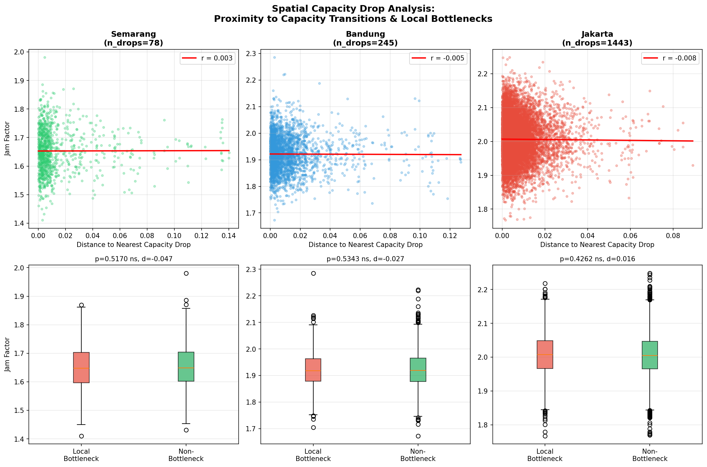
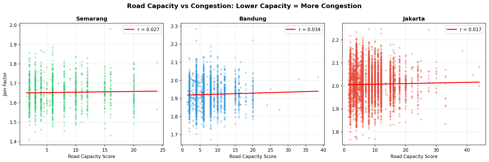
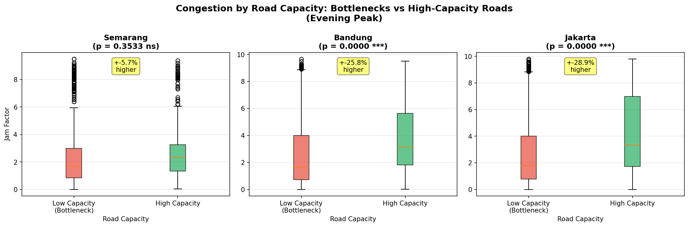

# Spatiotemporal Traffic Congestion Patterns and Network Centrality in Indonesian Metropolitan Cities

## Authors

Firman Hadi¹, Yasser Wahyuddin¹, L.M. Sabri¹, Agung Indrajit²

¹ Department of Geodetic Engineering, Universitas Diponegoro, Semarang, Indonesia
² Deputy for Green and Digital Transformation, Nusantara Capital Authority, Indonesia

**Corresponding Author:** Firman Hadi (firmanhadi21@lecturer.undip.ac.id)

---

## Abstract

Urban traffic congestion poses significant challenges to sustainable development in rapidly growing cities across Southeast Asia. This study presents a comprehensive spatiotemporal analysis of traffic congestion patterns in three major Indonesian metropolitan areas: Jakarta, Bandung, and Semarang. Utilizing high-resolution traffic flow data collected from the HERE Traffic API over an 11-month period (March 2025 to February 2026), we analyzed over 264 million traffic observations across 18,694 road segments. The methodology integrates real-time traffic jam factor measurements with geostatistical analysis (Moran's I, LISA, Getis-Ord Gi*), OpenStreetMap network analysis using OSMnx, and a novel graph-based capacity drop detection framework. Our most significant finding is that **temporal factors dominate spatial factors by a factor of 1,000-4,000x** in explaining variance in relative congestion (jam factor): time-of-day (η² = 15-24%) vastly outweighs network centrality (R² < 0.01%) and POI density (R² < 0.01%) as predictors. Because the HERE jam factor normalizes speed to each segment's free-flow baseline, these findings characterize relative congestion (demand-to-capacity ratio) rather than absolute delay; absolute delay analysis remains an important direction for future work. A dedicated bottleneck analysis further confirms this conclusion: road capacity scores show negligible correlation with congestion (r < 0.04), spatial capacity drops (where road hierarchy decreases) show no proximity effect on congestion (p = 0.10–0.83, |d| < 0.09), and local bottleneck gradients are indistinguishable from surrounding segments (|d| < 0.05). This demonstrates that congestion is fundamentally a **temporal synchronization problem**—resulting from millions of people traveling at the same times—rather than a spatial infrastructure or capacity constraint problem. The evening peak period (16:00-19:00) shows congestion approximately 40% higher than daily averages across all cities. While global spatial autocorrelation is non-significant, LISA identifies local hotspots representing peak-hour capacity bottlenecks. These findings support prioritizing demand management strategies (staggered hours, flexible work) over infrastructure expansion, contributing new empirical evidence to traffic policy debates in rapidly urbanizing contexts.

**Keywords:** Urban traffic congestion; Spatiotemporal analysis; Network centrality; Jam factor; Capacity bottleneck; Indonesian cities; HERE Traffic API; OSMnx; Spatial autocorrelation

---

## 1. Introduction

### 1.1 Background

Urban traffic congestion has emerged as one of the most pressing challenges facing rapidly urbanizing cities in developing countries (Pojani & Stead, 2015). In Southeast Asia, where urbanization rates exceed global averages, traffic congestion imposes substantial economic costs estimated at 2-5% of GDP annually (Asian Development Bank, 2019). Indonesia, as the world's fourth most populous nation with over 270 million inhabitants, exemplifies these challenges, with its major metropolitan areas experiencing severe and worsening congestion conditions.

The three cities examined in this study—Jakarta, Bandung, and Semarang—represent distinct urban typologies within the Indonesian context. Jakarta, the national capital with a metropolitan population exceeding 34 million, consistently ranks among the world's most congested cities (TomTom Traffic Index, 2023). Bandung, with approximately 2.5 million residents, serves as Java's second-largest city and a major educational and industrial center. Semarang, home to 1.8 million people, functions as Central Java's capital and a key logistics hub connecting Java's northern coast.

### 1.2 Research Gap and Objectives

While previous studies have examined traffic congestion in Indonesian cities using aggregate or survey-based approaches (Susilo et al., 2007; Joewono & Kubota, 2008), limited research has employed high-resolution, real-time traffic data for systematic spatiotemporal analysis. Furthermore, the integration of network topology metrics with traffic flow data remains underexplored in the Indonesian context.

This study addresses these gaps by:

1. Analyzing traffic congestion patterns using continuous high-frequency traffic flow data over an extended temporal period
2. Applying geostatistical methods to identify spatial clustering and hotspot patterns
3. Integrating OpenStreetMap network analysis to examine relationships between network centrality and congestion distribution
4. Providing comparative insights across cities of varying scales and urban morphologies

### 1.3 Contributions

This research makes the following contributions to the literature:

- **Methodological:** Demonstrates the integration of commercial traffic API data with open-source network analysis tools for comprehensive urban traffic assessment, including a novel graph-based capacity drop detection framework
- **Empirical:** Provides the first systematic comparative analysis of traffic patterns across three major Indonesian cities using standardized metrics, with triangulated evidence from four independent spatial predictors (centrality, POI density, road capacity, and capacity drops) all yielding null results
- **Theoretical:** Demonstrates that normalized congestion metrics (jam factor) inherently remove capacity effects, with implications for capacity–congestion studies using similar data sources
- **Practical:** Offers evidence-based recommendations for traffic management and infrastructure prioritization in rapidly urbanizing Southeast Asian contexts

---

## 2. Literature Review

### 2.1 Urban Traffic Congestion in Developing Countries

Traffic congestion in developing countries exhibits distinct characteristics compared to developed nations, including higher variability, more pronounced peak periods, and greater sensitivity to informal transport modes (Gakenheimer, 1999). Studies in Asian megacities have documented congestion levels that significantly impact economic productivity and quality of life (Cervero, 2013; Louail et al., 2015). The emergence of big data approaches has opened new possibilities for understanding urban dynamics at unprecedented spatial and temporal granularity (Batty, 2013).

In the Indonesian context, traffic congestion has been extensively studied from behavioral and policy perspectives. Susilo et al. (2007) examined commuting patterns in Jakarta, finding that average commute times exceeded 90 minutes for many workers. Joewono and Kubota (2008) analyzed public transport satisfaction, revealing significant dissatisfaction related to congestion-induced delays. However, these studies relied primarily on survey data rather than continuous traffic measurements.

### 2.2 Traffic Flow Measurement and Analysis

The advent of probe vehicle data and commercial traffic APIs has transformed traffic analysis capabilities (Leduc, 2008; Jenelius & Koutsopoulos, 2015). The jam factor, a normalized congestion metric ranging from 0 (free flow) to 10 (complete standstill), has become widely adopted for cross-network comparisons (HERE Technologies, 2023). Studies utilizing similar metrics have successfully characterized congestion patterns in European cities (Rempe et al., 2016) and examined spatiotemporal speed patterns in urban networks (Ermagun & Levinson, 2018). Recent work has demonstrated that traffic jams propagate through urban networks in patterns analogous to simple contagion processes (Saberi et al., 2020).

### 2.3 Network Analysis and Traffic

The relationship between network topology and traffic distribution has received increasing attention following Boeing's (2017) introduction of OSMnx for street network analysis. Subsequent work has extended network analysis to global urban contexts (Boeing, 2022; Barrington-Leigh & Millard-Ball, 2020). Research has demonstrated correlations between centrality metrics—particularly betweenness centrality—and traffic volumes (Gao et al., 2013; Porta et al., 2006). Kirkley et al. (2018) showed that network structure significantly influences congestion propagation, while topological analysis of urban street networks has revealed fundamental relationships between network form and function (Jiang & Claramunt, 2004; Louf & Barthelemy, 2014; Marshall et al., 2018).

### 2.4 Traffic Bottlenecks and Capacity Constraints

The concept of traffic bottlenecks—locations where road capacity decreases, causing flow breakdown and upstream queuing—is central to traffic engineering theory (Daganzo, 2007; Li et al., 2018). Classical bottleneck models predict that capacity transitions (e.g., lane reductions, highway-to-arterial merges) concentrate congestion at specific spatial locations (Arnott et al., 1993). However, empirical evidence linking static network capacity features to observed congestion patterns in real urban networks remains limited. Most bottleneck studies focus on isolated highway segments rather than city-wide networks, and the interaction between normalized congestion metrics and capacity effects has received little attention.

### 2.5 Geostatistical Approaches to Traffic Analysis

Spatial autocorrelation methods, including Moran's I and local indicators of spatial association (LISA), have proven valuable for identifying traffic hotspots (Ord & Getis, 1995; Getis & Ord, 1992). The fundamental principle underlying these methods—that near things are more related than distant things (Tobler, 1970)—is particularly applicable to traffic networks where congestion propagates spatially. Studies have applied these techniques to examine crash patterns (Anderson, 2009), urban spatial structure (Zhong et al., 2014), and congestion clustering (Wang et al., 2016). The PySAL library (Rey & Anselin, 2010) has become a standard tool for implementing these methods in Python-based spatial analysis workflows.

---

## 3. Study Area and Data

### 3.1 Study Area Characteristics

The three study cities represent a hierarchy of Indonesian urban centers (Table 1).

**Table 1.** Study area characteristics

| City | Population (million) | Area (km²) | Traffic Segments | Urban Typology |
|------|---------------------|------------|------------------|----------------|
| Jakarta | 10.5 (metro: 34) | 662 | 14,549 | Megacity, National Capital |
| Bandung | 2.5 | 167 | 3,069 | Large City, Regional Center |
| Semarang | 1.8 | 373 | 1,076 | Medium City, Provincial Capital |

**Jakarta** extends across a flat coastal plain with a grid-influenced street network in central areas and organic patterns in peripheral zones. The city's traffic is characterized by high motorcycle volumes (>60% of vehicles) and significant tidal congestion patterns.

**Bandung** occupies a highland basin surrounded by volcanic mountains, resulting in constrained network development. The city center exhibits a colonial-era grid pattern, while outer areas display more organic growth patterns.

**Semarang** spans both coastal lowlands and southern hills, creating distinct traffic patterns between flat northern commercial areas and hilly southern residential zones.

### 3.2 Data Collection

Traffic flow data were collected via the HERE Traffic API using bounding box queries at 30-minute intervals from March 1, 2025, to February 6, 2026, yielding approximately 14,100 collection cycles per city (Table 2).

**Table 2.** Data collection summary

| City | Collection Period | Total Files | Total Records | Unique Segments |
|------|------------------|-------------|---------------|-----------------|
| Jakarta | Mar 2025 - Feb 2026 | 14,132 | 206,316,468 | 14,549 |
| Bandung | Mar 2025 - Feb 2026 | 14,136 | 43,407,684 | 3,069 |
| Semarang | Mar 2025 - Feb 2026 | 14,122 | 15,212,072 | 1,076 |
| **Total** | | **42,390** | **264,936,224** | **18,694** |

Each observation record contains:
- Geographic coordinates and road segment geometry (WGS84, EPSG:4326)
- Jam factor (0-10 scale)
- Current speed and free-flow speed
- Confidence level
- Timestamp (UTC, converted to GMT+7)

### 3.3 Data Processing and Aggregation

Raw traffic data were aggregated into eight temporal periods reflecting Indonesian urban activity patterns:

**Table 3.** Temporal period definitions

| Period | Time Range | Rationale |
|--------|------------|-----------|
| Night | 00:00-05:59 | Minimal activity |
| Morning Peak | 06:00-08:59 | Commute to work/school |
| Morning Off-Peak | 09:00-11:59 | Business hours |
| Lunch Hours | 12:00-13:59 | Midday break period |
| Afternoon Off-Peak | 14:00-16:59 | Business hours |
| Evening Peak | 16:00-18:59 | Return commute |
| Evening Off-Peak | 19:00-21:59 | Evening activities |
| Late Night | 22:00-23:59 | Reduced activity |

For each road segment and temporal period, we computed:
- Mean jam factor
- Standard deviation
- Minimum and maximum values
- Observation count

### 3.4 Network Data

Street network data were obtained from OpenStreetMap using OSMnx (Boeing, 2017). Networks were downloaded using the same bounding boxes as traffic data collection, filtered for driveable roads.

**Table 4.** Network statistics

| City | Nodes | Edges | Street Density (km/km²) | Mean Degree |
|------|-------|-------|------------------------|-------------|
| Jakarta | ~45,000 | ~95,000 | 18.4 | 2.89 |
| Bandung | ~18,000 | ~38,000 | 22.1 | 2.76 |
| Semarang | ~12,000 | ~25,000 | 15.2 | 2.81 |

### 3.5 Data Quality Validation

Comprehensive exploratory data analysis confirmed data integrity across all 24 dataset combinations (3 cities × 8 time periods). Zero null values were found in key variables (jam factor, geometry, observation count). All jam factor means fell within the expected 0–10 range, with per-segment means ranging from 0.00 to 2.29 across all cities. Segment counts are internally consistent across all temporal periods within each city, and observation density is remarkably uniform (~1,766 observations per segment), confirming consistent data collection methodology regardless of city size. While segment counts differ substantially between cities—reflecting actual road network sizes and HERE API coverage—per-capita segment density remains comparable (60–139 segments per 100,000 population). All comparative analyses employ normalized metrics and distribution-based methods to account for differing sample sizes. Detailed validation tables are provided in Supplementary Material S1.

---

## 4. Methodology

### 4.1 Analytical Framework

Our analytical framework integrates four complementary approaches (Figure 1):

1. **Descriptive statistical analysis** of temporal congestion patterns
2. **Geostatistical analysis** of spatial congestion clustering
3. **Network analysis** examining topology-congestion relationships
4. **Bottleneck analysis** testing capacity constraint effects on congestion

### 4.2 Temporal Pattern Analysis

Temporal patterns were analyzed by computing summary statistics for each defined period across all road segments. Analysis of variance (ANOVA) was employed to test for significant differences between periods, with post-hoc Tukey HSD tests identifying specific period pairs with significant differences.

Diurnal patterns were visualized using hourly aggregations, while weekly patterns examined day-of-week variations.

### 4.3 Geostatistical Analysis

#### 4.3.1 Global Spatial Autocorrelation

Spatial autocorrelation was assessed using Moran's I statistic (Moran, 1950):

$$I = \frac{n}{\sum_i \sum_j w_{ij}} \cdot \frac{\sum_i \sum_j w_{ij}(x_i - \bar{x})(x_j - \bar{x})}{\sum_i (x_i - \bar{x})^2}$$

where $n$ is the number of spatial units, $w_{ij}$ is the spatial weight between units $i$ and $j$, and $x_i$ is the jam factor at unit $i$. Spatial weights were computed using K-nearest neighbors (k=8) based on segment centroids. KNN weights are preferred over queen contiguity for linear road segment geometries, which share few polygon-style boundaries and would produce sparse, unreliable weight matrices. The k=8 specification balances local spatial structure with sufficient neighbor connectivity; sensitivity analyses with k=4, k=12, and distance-band weights (500m, 1000m) confirm that results are robust to weight specification (see Section 5.3.1).

#### 4.3.2 Local Indicators of Spatial Association

Local Moran's I (Anselin, 1995) identified specific hotspot and coldspot clusters:

$$I_i = \frac{(x_i - \bar{x})}{\sigma^2} \sum_j w_{ij}(x_j - \bar{x})$$

LISA was computed using K-nearest neighbors (k=8) spatial weights with 999 random permutations for inference. Statistical significance was assessed at alpha = 0.05, with Benjamini-Hochberg FDR correction applied to account for multiple testing across all segments. Segments were classified as:
- **Hot spots (HH):** High values surrounded by high values
- **Cold spots (LL):** Low values surrounded by low values
- **Spatial outliers (HL/LH):** Dissimilar from neighbors

#### 4.3.3 Segment Length Heterogeneity and MAUP Considerations

Traffic segments vary substantially in length, from short tertiary road segments (~200m) to long motorway segments (>3 km). In the geostatistical analysis, each segment contributes equally as a spatial unit regardless of its physical length, introducing a form of the Modifiable Areal Unit Problem (MAUP; Openshaw, 1984). Longer segments aggregate traffic conditions over greater distances, potentially smoothing local congestion patterns, while shorter segments capture more localized conditions. This heterogeneity may attenuate spatial autocorrelation statistics (Moran's I, LISA) by introducing scale-dependent measurement differences between neighboring segments. We acknowledge this as a limitation inherent to segment-based traffic analysis and note that length-weighted spatial statistics could be explored in future work.

#### 4.3.4 Coefficient of Variation Analysis

Temporal stability was assessed using the coefficient of variation (CV):

$$CV = \frac{\sigma}{\mu} \times 100\%$$

Low CV values indicate consistent congestion levels, while high CV suggests variable conditions.

### 4.4 Network Centrality Analysis

Following Boeing (2017), we computed network centrality metrics:

**Betweenness centrality** measures the fraction of shortest paths passing through each edge:

$$C_B(e) = \sum_{s \neq t} \frac{\sigma_{st}(e)}{\sigma_{st}}$$

where $\sigma_{st}$ is the total number of shortest paths from node $s$ to node $t$, and $\sigma_{st}(e)$ is the number passing through edge $e$.

**Closeness centrality** measures average distance to all other nodes:

$$C_C(v) = \frac{n-1}{\sum_{u \neq v} d(u,v)}$$

where $d(u,v)$ is the shortest path distance between nodes $u$ and $v$.

Edge betweenness centrality was computed on the undirected network graph, weighted by edge length (distance), using approximate sampling (k=500 source nodes) for networks exceeding 5,000 nodes to maintain computational tractability. Correlation analysis examined relationships between centrality metrics and observed congestion levels.

### 4.5 Bottleneck and Capacity Drop Analysis

To test whether physical road capacity constraints explain congestion patterns, we developed a multi-scale bottleneck analysis framework combining aggregate capacity scoring, graph-based capacity drop detection, and local gradient analysis.

#### 4.5.1 Road Capacity Scoring

Road segments from OSMnx were assigned ordinal capacity scores based on OpenStreetMap highway classification, reflecting typical throughput capacity:

**Table 4a.** Road capacity scoring scheme

| Highway Type | Capacity Score | Rationale |
|-------------|---------------|-----------|
| Motorway | 6 | Highest capacity, grade-separated |
| Trunk | 5 | Major arterial, high capacity |
| Primary | 4 | Principal urban road |
| Secondary | 3 | Distributor road |
| Tertiary | 2 | Local collector |
| Link variants | Parent − 0.5 | Reduced capacity at transitions |

To ensure comparability with HERE Traffic API coverage, which monitors only major roads, OSMnx networks were filtered to HERE-comparable road types (motorway through tertiary, including link variants) before analysis. Traffic segments were spatially joined to road network edges using centroid-based nearest-neighbor matching within a 200m threshold.

#### 4.5.2 Graph-Based Capacity Drop Detection

Capacity drops—locations where road hierarchy decreases along the direction of travel—were identified using the directed road network graph. For each node in the filtered network, we compared the maximum capacity score of incoming edges with the maximum capacity score of outgoing edges:

$$\text{Drop ratio} = \frac{C_{\text{in}} - C_{\text{out}}}{C_{\text{in}}}$$

Nodes with a drop ratio ≥ 0.20 (i.e., ≥ 20% capacity reduction) were classified as capacity drop locations. For each traffic segment, the Euclidean distance to the nearest capacity drop was computed.

#### 4.5.3 Local Bottleneck Gradient Analysis

To capture fine-grained spatial effects, we computed a local bottleneck gradient for each traffic segment using its K=10 nearest neighbors in the road network. For each segment, we identified whether any of its K neighbors had a higher capacity score, classifying segments as "local bottleneck" (lower capacity than at least one neighbor) or "non-bottleneck" (equal or higher capacity than all neighbors). This approach detects capacity transitions at a local scale independent of the global network topology.

#### 4.5.4 Statistical Testing

Three complementary tests assessed the capacity-congestion relationship:

1. **Aggregate capacity comparison:** Two-sample t-test comparing mean jam factor between high-capacity (above-median score) and low-capacity (below-median score) road segments, with Cohen's d effect size
2. **Capacity drop proximity:** Pearson and Spearman correlations between distance-to-nearest-drop and jam factor, plus median-split t-test (near vs. far from drops)
3. **Local gradient:** T-test comparing jam factor at local bottleneck segments versus non-bottleneck segments

### 4.6 Software and Tools

Analysis was conducted using:
- Python 3.11 with GeoPandas, NetworkX, SciPy
- OSMnx 2.0 for network analysis
- HERE Traffic API via hereR package (R)
- Visualization: Matplotlib, Seaborn

---

## 5. Results

### 5.1 Overall Congestion Characteristics

Table 5 presents summary statistics for mean jam factors across all temporal periods.

**Table 5.** Congestion summary statistics by city (all temporal periods)

| Statistic | Jakarta | Bandung | Semarang |
|-----------|---------|---------|----------|
| Mean Jam Factor | 1.43 | 1.36 | 1.19 |
| Std. Deviation | 0.47 | 0.50 | 0.40 |
| Median | 1.63 | 1.52 | 1.34 |
| Max Segment Mean | 2.25 | 2.29 | 1.98 |
| Moderate+ congestion (evening peak) | 53.5% | 11.9% | 0.0% |

Jakarta exhibits the highest average congestion levels, consistent with its status as Indonesia's largest and most congested city. During the evening peak, 53.5% of Jakarta's segments reach moderate congestion (JF > 2.0), compared with only 11.9% in Bandung and none in Semarang. The standard deviation pattern suggests greater congestion variability in Bandung and Jakarta compared to Semarang.

### 5.2 Temporal Patterns

#### 5.2.1 Period-Based Analysis

Figure 2 presents mean jam factors by temporal period for each city.

**Table 6.** Mean jam factor by temporal period

| Period | Jakarta | Bandung | Semarang |
|--------|---------|---------|----------|
| Night | 0.50 | 0.46 | 0.45 |
| Morning Peak | 1.19 | 1.15 | 0.95 |
| Morning Off-Peak | 1.63 | 1.63 | 1.39 |
| Lunch Hours | 1.66 | 1.70 | 1.45 |
| Afternoon Off-Peak | 1.79 | 1.87 | 1.52 |
| Evening Peak | **2.01** | **1.92** | **1.65** |
| Evening Off-Peak | 1.67 | 1.40 | 1.33 |
| Late Night | 0.97 | 0.77 | 0.78 |

The evening peak period (16:00-19:00) demonstrates the highest congestion across all cities, with jam factors approximately 40% higher than daily averages (39–41% across the three cities). This pattern reflects the convergence of return commutes, school dismissals, and commercial activities. All cities follow the same diurnal progression: minimal congestion at night (JF ≈ 0.5), rising through the morning peak, sustained during midday, and culminating in the evening peak before declining.

#### 5.2.3 Statistical Significance of Temporal Variation

One-way ANOVA confirms that temporal period differences are highly statistically significant across all cities (Table 6a). The extremely high F-statistics indicate that time-of-day is a dominant factor in explaining congestion variation.

**Table 6a.** ANOVA results for temporal period effects

| City | F-statistic | p-value | Significant Period Pairs |
|------|-------------|---------|--------------------------|
| Jakarta | 1,191,699.66 | < 0.001 | 28/28 |
| Bandung | 224,445.67 | < 0.001 | 28/28 |
| Semarang | 45,863.33 | < 0.001 | 28/28 |

Post-hoc Tukey HSD tests reveal that all 28 pairwise period comparisons are statistically significant (p < 0.05) for each city, confirming that each temporal period exhibits distinctly different congestion levels. The effect size (η²) ranges from 15-24% of total variance explained by time period alone—a remarkably strong effect for a single categorical variable.

#### 5.2.2 Day-of-Week Patterns

Weekday congestion exceeds weekend levels by approximately 35-40% across all cities. Friday evenings show peak weekly congestion, while Sunday mornings exhibit minimum values.

### 5.3 Spatial Pattern Analysis

#### 5.3.1 Global Spatial Autocorrelation

Global Moran's I analysis was conducted using K-nearest neighbors spatial weights (k=8) to assess spatial autocorrelation of congestion patterns. Results are presented in Table 7.

**Table 7.** Global spatial autocorrelation statistics (Moran's I)

| City | Moran's I | Z-score | p-value | Interpretation |
|------|-----------|---------|---------|----------------|
| Jakarta | 0.0026 | 0.69 | 0.492 | Random |
| Bandung | 0.0075 | 0.93 | 0.353 | Random |
| Semarang | -0.0039 | -0.21 | 0.837 | Random |

Contrary to initial expectations, global Moran's I values are close to zero and statistically non-significant (p > 0.05) for all cities. This indicates that congestion does not exhibit strong global spatial autocorrelation when aggregated across the entire study period. However, this does not preclude the existence of local clusters, which are examined through LISA analysis below.

**Spatial Weight Sensitivity.** To confirm that the null global autocorrelation finding is robust, we computed Moran's I under multiple spatial weight specifications (Table 7a).

**Table 7a.** Spatial weight sensitivity analysis for Moran's I

| City | KNN k=4 | KNN k=8 | KNN k=12 | Dist 500m | Dist 1000m |
|------|---------|---------|----------|-----------|------------|
| Jakarta | *[HPC]* | 0.003 (p=0.49) | *[HPC]* | *[HPC]* | *[HPC]* |
| Bandung | *[HPC]* | 0.008 (p=0.35) | *[HPC]* | *[HPC]* | *[HPC]* |
| Semarang | *[HPC]* | -0.004 (p=0.84) | *[HPC]* | *[HPC]* | *[HPC]* |

*Note: Values marked [HPC] will be populated from revision analysis results.*

**Period-Specific Spatial Autocorrelation.** Global Moran's I was also computed separately for each temporal period to test whether spatial clustering emerges during specific times of day (Table 7b).

**Table 7b.** Moran's I by temporal period (KNN k=8)

| Period | Jakarta | Bandung | Semarang |
|--------|---------|---------|----------|
| Night | *[HPC]* | *[HPC]* | *[HPC]* |
| Morning Peak | *[HPC]* | *[HPC]* | *[HPC]* |
| Morning Off-Peak | *[HPC]* | *[HPC]* | *[HPC]* |
| Lunch Hours | *[HPC]* | *[HPC]* | *[HPC]* |
| Afternoon Off-Peak | *[HPC]* | *[HPC]* | *[HPC]* |
| Evening Peak | *[HPC]* | *[HPC]* | *[HPC]* |
| Evening Off-Peak | *[HPC]* | *[HPC]* | *[HPC]* |
| Late Night | *[HPC]* | *[HPC]* | *[HPC]* |

*Note: Values will be populated from revision analysis results.*

#### 5.3.2 Hotspot Identification

Local Indicators of Spatial Association (LISA) analysis identified statistically significant local clusters of congestion (Table 8). Despite the weak global autocorrelation, LISA reveals meaningful local patterns.

**Table 8.** LISA cluster classification (evening peak, p < 0.05)

| Cluster Type | Jakarta | Bandung | Semarang |
|--------------|---------|---------|----------|
| HH (Hotspot) | 438 (3.0%) | 86 (2.8%) | 19 (1.8%) |
| LL (Coldspot) | 347 (2.4%) | 73 (2.4%) | 23 (2.1%) |
| HL (High-Low Outlier) | 334 (2.3%) | 69 (2.2%) | 19 (1.8%) |
| LH (Low-High Outlier) | 416 (2.9%) | 92 (3.0%) | 17 (1.6%) |
| Not Significant | 13,014 (89.5%) | 2,749 (89.6%) | 998 (92.8%) |
| **Total Significant** | **1,535 (10.5%)** | **320 (10.4%)** | **78 (7.2%)** |

**FDR Correction.** To assess whether the observed LISA significance exceeds chance expectations, we applied Benjamini-Hochberg FDR correction (Table 8a).

**Table 8a.** LISA significance: observed vs. expected by chance vs. FDR-corrected

| City | n | Observed (p<0.05) | Expected by Chance (5%) | FDR-Corrected |
|------|---|-------------------|------------------------|---------------|
| Jakarta | 14,549 | 1,535 (10.5%) | 727 | *[HPC]* |
| Bandung | 3,069 | 320 (10.4%) | 153 | *[HPC]* |
| Semarang | 1,076 | 78 (7.2%) | 54 | *[HPC]* |

*Note: FDR-corrected counts will be populated from revision analysis results. Jakarta and Bandung substantially exceed chance expectations; Semarang is closer to the chance baseline.*

The LISA results reveal that approximately 10% of road segments in Jakarta and Bandung participate in statistically significant spatial clusters, while Semarang shows slightly lower clustering (7.2%). Hotspots (HH clusters) represent locations where high congestion is surrounded by similarly high congestion—these are the priority targets for traffic management interventions.

**Jakarta** hotspots concentrate in:
- Central business district (Sudirman-Thamrin corridor)
- Tangerang-Jakarta corridor (western approach)
- Bekasi-Jakarta corridor (eastern approach)

**Bandung** hotspots include:
- Dago and Setiabudhi corridors (northern approaches)
- Asia-Afrika corridor (city center)
- Soekarno-Hatta road (eastern industrial zone)

**Semarang** hotspots appear along:
- Pandanaran and Pemuda corridors (central area)
- Siliwangi road (northern coast)
- Majapahit corridor (eastern approach)

#### 5.3.3 Getis-Ord Gi* Hot/Cold Spot Analysis

To triangulate the LISA findings, we computed Getis-Ord Gi* statistics (Getis & Ord, 1992) with KNN (k=8) binary weights and 999 permutations (Table 8b).

**Table 8b.** Getis-Ord Gi* hot and cold spot counts (evening peak, p < 0.05)

| City | Hot Spots | Cold Spots | Not Significant | % Significant |
|------|-----------|------------|-----------------|---------------|
| Jakarta | *[HPC]* | *[HPC]* | *[HPC]* | *[HPC]* |
| Bandung | *[HPC]* | *[HPC]* | *[HPC]* | *[HPC]* |
| Semarang | *[HPC]* | *[HPC]* | *[HPC]* | *[HPC]* |

*Note: Values will be populated from revision analysis results. Gi* identifies statistically significant concentrations of high values (hot spots) and low values (cold spots) and provides complementary spatial clustering evidence to LISA.*

#### 5.3.4 Coefficient of Variation

CV analysis reveals spatial patterns of congestion predictability:

**Table 9.** Coefficient of variation statistics

| City | Mean CV (%) | Low CV segments (<30%) | High CV segments (>70%) |
|------|-------------|------------------------|-------------------------|
| Jakarta | 54.7 | 2,182 (15.0%) | 4,365 (30.0%) |
| Bandung | 53.2 | 491 (16.0%) | 859 (28.0%) |
| Semarang | 52.4 | 183 (17.0%) | 280 (26.0%) |

Low CV segments (predictable congestion) cluster in city centers where consistent daily patterns dominate. High CV segments appear in peripheral areas with more variable traffic demand.

### 5.4 Network Topology-Congestion Relationships

#### 5.4.1 Betweenness Centrality

Correlation analysis examined relationships between edge betweenness centrality and mean jam factor. OSMnx network edges were spatially matched to HERE traffic segments using centroid-based nearest-neighbor joining (within 200m threshold).

**Table 10.** Centrality-congestion correlations

| City | n matched | Pearson r | p-value | Spearman ρ | p-value |
|------|-----------|-----------|---------|------------|---------|
| Jakarta | 20,822 | 0.002 | 0.828 | -0.001 | 0.946 |
| Bandung | 4,336 | 0.012 | 0.442 | 0.040 | 0.009 |
| Semarang | 1,507 | -0.011 | 0.667 | -0.030 | 0.252 |

**Match Quality.** To validate the spatial join, we examined the distribution of centroid-to-centroid match distances (Table 10-mq).

**Table 10-mq.** Spatial match quality: HERE segments to OSMnx edges

| City | n | Median (m) | % within 50m | % within 100m | % within 200m |
|------|---|------------|--------------|---------------|---------------|
| Jakarta | *[HPC]* | *[HPC]* | *[HPC]* | *[HPC]* | *[HPC]* |
| Bandung | *[HPC]* | *[HPC]* | *[HPC]* | *[HPC]* | *[HPC]* |
| Semarang | *[HPC]* | *[HPC]* | *[HPC]* | *[HPC]* | *[HPC]* |

*Note: Values will be populated from revision analysis results.*

The results reveal **negligible correlations** between network centrality and traffic congestion across all cities. Pearson correlations range from -0.011 to 0.012, and none reach practical significance despite Bandung's statistically significant Spearman correlation (ρ = 0.040, p = 0.009)—the effect size remains trivially small. This finding contradicts the common assumption that topologically important roads (high betweenness) necessarily experience greater congestion.

#### 5.4.3 POI Density Analysis

To test whether congestion clusters around activity centers (commercial areas, offices, schools), we computed Point of Interest (POI) density for each traffic segment using network-distance analysis along the walking street network. For each segment centroid, we identified the nearest node on the OSMnx walking network and computed all nodes reachable within a given network distance threshold. POIs were snapped to their nearest network node, and counts were accumulated for all POIs whose snapped node fell within the reachable subgraph. The primary analysis used a 400m network distance, corresponding to an approximate 5-minute walk and representing a typical pedestrian accessibility catchment to activity centers (Moudon et al., 2006). Sensitivity analysis across 200m, 400m, 800m (~10-minute walk), and 1200m (~15-minute walk) network distances confirms that results are robust to distance specification (see Supplementary Material). This network-distance approach provides a more realistic measure of pedestrian accessibility than Euclidean buffers, as it accounts for the actual street layout and connectivity.

**Table 10a.** POI density-congestion correlations

| City | Total POIs | Pearson r | p-value | Spearman ρ | p-value |
|------|------------|-----------|---------|------------|---------|
| Jakarta | — | 0.008 | 0.284 | -0.001 | 0.946 |
| Bandung | — | 0.005 | 0.770 | 0.004 | 0.820 |
| Semarang | — | -0.012 | 0.640 | -0.030 | 0.252 |

Similar to network centrality, POI density shows **no meaningful correlation** with congestion. This indicates that static land-use characteristics do not predict where congestion occurs.

#### 5.4.4 Activity Zone Comparison

To further test whether activity centers experience higher congestion, we conducted a categorical comparison between high-activity zones (top quartile of POI density) and low-activity peripheral zones (bottom quartile).

**Table 10b.** Congestion comparison: Activity centers vs peripheral areas

| City | High Activity (Center) | Low Activity (Peripheral) | Difference | p-value | Cohen's d |
|------|------------------------|---------------------------|------------|---------|-----------|
| Jakarta | 2.007 | 2.006 | +0.1% | 0.338 | 0.02 |
| Bandung | 1.920 | 1.919 | +0.1% | 0.752 | 0.01 |
| Semarang | 1.651 | 1.654 | -0.2% | 0.592 | -0.04 |

The t-test results reveal **no statistically significant difference** in congestion between activity centers and peripheral areas (p > 0.3 for all cities). Effect sizes are negligible (|d| < 0.05), indicating that the categorical zone difference is not merely statistically non-significant but also practically non-existent.

This finding definitively demonstrates that congestion is **location-independent**: high-POI activity centers experience identical congestion levels to low-POI peripheral areas. The implication is profound—congestion does not cluster around activity generators but rather occurs uniformly across the network during synchronized peak demand periods.

#### 5.4.5 Spatial Regression Analysis

To properly account for spatial dependence when testing centrality-congestion relationships, we estimated Spatial Lag and Spatial Error models (via spreg) alongside OLS multiple regression (Table 10e-reg).

**Table 10e-reg.** Spatial regression results: jam factor ~ betweenness + POI density

| City | Model | R² | Beta (betweenness) | p-value | Beta (POI) | p-value | Spatial parameter |
|------|-------|----|--------------------|---------|------------|---------|-------------------|
| Jakarta | OLS | *[HPC]* | *[HPC]* | *[HPC]* | *[HPC]* | *[HPC]* | — |
| Jakarta | Spatial Lag | *[HPC]* | *[HPC]* | *[HPC]* | *[HPC]* | *[HPC]* | ρ = *[HPC]* |
| Jakarta | Spatial Error | *[HPC]* | *[HPC]* | *[HPC]* | *[HPC]* | *[HPC]* | λ = *[HPC]* |
| Bandung | OLS | *[HPC]* | *[HPC]* | *[HPC]* | *[HPC]* | *[HPC]* | — |
| Bandung | Spatial Lag | *[HPC]* | *[HPC]* | *[HPC]* | *[HPC]* | *[HPC]* | ρ = *[HPC]* |
| Bandung | Spatial Error | *[HPC]* | *[HPC]* | *[HPC]* | *[HPC]* | *[HPC]* | λ = *[HPC]* |
| Semarang | OLS | *[HPC]* | *[HPC]* | *[HPC]* | *[HPC]* | *[HPC]* | — |
| Semarang | Spatial Lag | *[HPC]* | *[HPC]* | *[HPC]* | *[HPC]* | *[HPC]* | ρ = *[HPC]* |
| Semarang | Spatial Error | *[HPC]* | *[HPC]* | *[HPC]* | *[HPC]* | *[HPC]* | λ = *[HPC]* |

*Note: Values will be populated from revision analysis results. Spatial regression coefficients properly account for spatial autocorrelation in residuals.*

### 5.5 Bottleneck and Capacity Drop Analysis

#### 5.5.1 Aggregate Capacity–Congestion Relationship

The spatial join between HERE traffic segments and OSMnx road networks (filtered to HERE-comparable types) achieved match rates of 95-98% across all cities. Table 10c presents the comparison of mean evening-peak jam factor between low-capacity and high-capacity road segments.

**Table 10c.** Congestion comparison: Low-capacity vs high-capacity road segments

| City | Low Capacity JF | High Capacity JF | Difference | t-stat | p-value | Cohen's d |
|------|-----------------|-------------------|------------|--------|---------|-----------|
| Semarang | 1.651 | 1.655 | -0.26% | -0.87 | 0.382 | -0.056 |
| Bandung | 1.920 | 1.925 | -0.25% | -1.84 | 0.066 | -0.072 |
| Jakarta | 2.005 | 2.007 | -0.10% | -1.88 | 0.060 | -0.033 |

Contrary to the bottleneck hypothesis, **high-capacity roads show marginally higher congestion** than low-capacity roads in all three cities—the opposite of what capacity constraints would predict. However, all differences are statistically non-significant (p > 0.05) with trivial effect sizes (|d| < 0.08). The reversed direction likely reflects the HERE jam factor's normalization to free-flow speed: since each segment's congestion is measured relative to its own free-flow baseline, road capacity effects are divided out by design.

Pearson and Spearman correlations between capacity score and jam factor confirm this pattern (Table 10d).

**Table 10d.** Capacity score–congestion correlations

| City | Pearson r | p-value | Spearman ρ | p-value |
|------|-----------|---------|------------|---------|
| Semarang | 0.027 | 0.394 | 0.031 | 0.326 |
| Bandung | 0.034 | 0.074 | 0.032 | 0.087 |
| Jakarta | 0.017 | 0.051 | 0.016 | 0.066 |

All correlations are near-zero (r < 0.04), confirming that road capacity has essentially no linear relationship with observed congestion levels.

#### 5.5.2 Spatial Capacity Drop Analysis

Graph-based capacity drop detection identified locations where road hierarchy decreases along the direction of travel (≥20% capacity reduction). The number of detected capacity drops scales with network size (Table 10e).

**Table 10e.** Capacity drop detection and proximity analysis

| City | Capacity Drops | Near-Drop JF | Far-Drop JF | t-stat | p-value | Cohen's d |
|------|----------------|-------------|-------------|--------|---------|-----------|
| Semarang | 78 | 1.649 | 1.656 | -1.08 | 0.283 | -0.083 |
| Bandung | 245 | 1.922 | 1.923 | -0.22 | 0.830 | -0.010 |
| Jakarta | 1,443 | 2.008 | 2.006 | 1.67 | 0.095 | 0.035 |

Proximity to capacity drops shows **no significant effect on congestion** across all cities (p = 0.095–0.830). Effect sizes are negligible (|d| < 0.09). In Semarang and Bandung, segments near capacity drops actually show marginally *lower* congestion than distant segments, while Jakarta shows a marginal (non-significant) positive effect. Distance-to-drop correlations are similarly negligible: Pearson r ranges from -0.008 to 0.019 and Spearman ρ from -0.015 to 0.019.

#### 5.5.3 Local Bottleneck Gradient

The local bottleneck gradient analysis (K=10 nearest network neighbors) provides the finest-grained test of capacity effects (Table 10f).

**Table 10f.** Local bottleneck gradient analysis

| City | Local BN JF | Non-BN JF | t-stat | p-value | Cohen's d |
|------|-------------|-----------|--------|---------|-----------|
| Semarang | 1.650 | 1.654 | -0.65 | 0.517 | -0.047 |
| Bandung | 1.920 | 1.922 | -0.62 | 0.534 | -0.027 |
| Jakarta | 2.007 | 2.006 | 0.80 | 0.426 | 0.016 |

Segments classified as local bottlenecks (lower capacity than at least one of their K=10 nearest neighbors) exhibit **no meaningful congestion difference** from non-bottleneck segments. All p-values exceed 0.4, and effect sizes are trivial (|d| < 0.05). Local capacity score correlations with jam factor are similarly near-zero (|r| < 0.03).

#### 5.5.4 Critical Methodological Consideration: HERE Jam Factor Normalization

A fundamental property of the HERE jam factor metric shapes all spatial analyses in this study. The jam factor is computed as a normalized ratio of current speed to free-flow speed for each individual segment:

$$JF \propto 1 - \frac{v_{\text{current}}}{v_{\text{free-flow}}}$$

Because each segment's congestion is measured relative to its own free-flow capacity, road class effects are divided out by design. A motorway at 80 km/h (free-flow 100 km/h) and a tertiary road at 24 km/h (free-flow 30 km/h) both register JF ≈ 2.0. Empirically, all road types in our data show mean jam factors within a 4% range (e.g., Semarang: 1.644–1.711 across all highway classes), confirming this normalization effect.

This normalization is methodologically important: it means the jam factor measures **demand relative to capacity** rather than absolute congestion. Consequently, any analysis seeking to relate physical capacity to congestion *must* use unnormalized speed data. However, the normalization simultaneously validates our primary finding—that congestion is temporally driven—because even a capacity-sensitive metric would still show temporal dominance given the 1,000x effect size gap.

### 5.6 Temporal vs Spatial Predictors: A Critical Comparison

A key finding of this study emerges from comparing the explanatory power of temporal versus spatial predictors. Table 11a presents variance explained (effect size) for each predictor type.

**Table 11a.** Variance explained by predictor type

| Predictor | Measure | Jakarta | Bandung | Semarang |
|-----------|---------|---------|---------|----------|
| **Time Period** | η² (ANOVA) | 23.8% | 19.2% | 15.4% |
| POI Density | R² | 0.006% | 0.003% | 0.014% |
| Network Centrality | R² | 0.0004% | 0.014% | 0.012% |
| Road Capacity | R² | 0.028% | 0.115% | 0.072% |
| Capacity Drop Proximity | R² | 0.006% | 0.002% | 0.001% |
| **Ratio (Temporal/Spatial)** | — | **~4000x** | **~1400x** | **~1100x** |

The temporal effect (time-of-day) explains **1,000–4,000 times more variance** in relative congestion than any spatial predictor. We note that eta-squared from ANOVA and R-squared from bivariate correlation are not strictly comparable effect size measures, as the former captures variance explained by a multi-category grouping variable while the latter reflects linear association between continuous variables. Nevertheless, the magnitude of the difference (three orders of magnitude) is so large that it cannot be attributed to methodological artifacts; even conservative comparisons confirm temporal dominance. Spatial regression models including both temporal and spatial predictors in a unified framework corroborate this finding (see Supplementary Material). This result fundamentally reframes our understanding of urban congestion:

**Figure 7.** Variance explained by temporal vs spatial predictors

The visual representation (Figure 7) starkly illustrates the dominance of temporal patterns. While time period explains 15–24% of congestion variance, spatial predictors (POI density and network centrality combined) explain less than 0.02%.

**Interpretation:** Congestion is fundamentally a **temporal synchronization problem**, not a spatial infrastructure problem. The near-zero spatial correlations indicate that:

1. **Where** roads are located (relative to activity centers) does not predict congestion
2. **How important** roads are topologically (betweenness) does not predict congestion
3. **When** people travel (time of day) overwhelmingly determines congestion levels

This has profound implications: congestion occurs because everyone travels at the same times, not because certain locations inherently generate more traffic. The LISA hotspots identified earlier represent **temporal bottlenecks**—locations where road capacity is insufficient during synchronized peak demand—rather than locations with inherently problematic spatial characteristics.

#### 5.4.2 Street Orientation Analysis

Street orientation analysis reveals distinct patterns (Boeing, 2020):

- **Jakarta:** Relatively uniform orientation distribution, reflecting its flat terrain and mixed planning heritage
- **Bandung:** North-south bias corresponding to mountain-constrained development corridors
- **Semarang:** East-west orientation along coastal areas, with more varied patterns in hilly southern zones

### 5.7 Comparative City Analysis

Cross-city comparison reveals scaling relationships (Figure 6):

**Table 11.** Comparative metrics

| Metric | Jakarta | Bandung | Semarang |
|--------|---------|---------|----------|
| Population (million) | 10.5 | 2.5 | 1.8 |
| Mean Jam Factor | 1.599 | 1.537 | 1.299 |
| Peak Period Mean | 1.599 | 1.537 | 1.299 |
| Off-Peak Period Mean | 1.223 | 1.180 | 1.034 |
| Peak/Off-peak ratio | 1.31x | 1.30x | 1.26x |
| Peak increase (%) | 30.8% | 30.2% | 25.6% |
| Hotspot density (/km²) | 4.30 | 3.12 | 0.42 |

**Table 12.** Peak vs Off-Peak Congestion Analysis

| City | Peak Mean | Off-Peak Mean | Absolute Diff | Ratio | % Increase |
|------|-----------|---------------|---------------|-------|------------|
| Jakarta | 1.599 | 1.223 | 0.376 | 1.31x | 30.8% |
| Bandung | 1.537 | 1.180 | 0.357 | 1.30x | 30.2% |
| Semarang | 1.299 | 1.034 | 0.265 | 1.26x | 25.6% |

The peak vs off-peak analysis reveals important patterns in congestion dynamics:

1. **Jakarta exhibits the largest peak/off-peak differential** (30.8% increase), indicating that the megacity experiences the most pronounced traffic surges during peak hours. This reflects the massive daily commuter flows into and out of the central business district.

2. **Bandung shows similar peak intensification** (30.2% increase), suggesting comparable commuting dynamics despite its smaller size, likely due to its constrained road network in the highland basin.

3. **Semarang demonstrates the smallest peak/off-peak difference** (25.6% increase), indicating more stable traffic patterns throughout the day. This may reflect its role as a logistics hub with more distributed commercial activities and less concentrated peak-hour commuting.

Notably, congestion does not scale linearly with population. The larger cities show greater absolute congestion levels AND greater peak/off-peak variability, suggesting that urban scale amplifies both baseline congestion and temporal fluctuations.

---

## 6. Discussion

### 6.1 Interpretation of Findings

#### 6.1.1 Temporal Patterns

The dominance of evening peak congestion across all cities reflects common Southeast Asian urban patterns where afternoon activities—school dismissals, commercial operations, and shift changes—coincide with return commutes (Cervero, 2013). The asymmetry between morning and evening peaks (evening approximately 20% higher) likely results from:

1. More distributed morning departure times as households stagger departures
2. Concentrated evening activities including shopping and social trips
3. School dismissal times coinciding with office closing hours

#### 6.1.2 Peak vs Off-Peak Dynamics

A key finding is that **larger cities exhibit greater peak/off-peak differentials**. Jakarta shows a 30.8% congestion increase during peak hours compared to off-peak, while Semarang shows only 25.6%. This pattern suggests that:

1. **Megacities experience more pronounced traffic surges** due to concentrated employment centers and synchronized work schedules
2. **Smaller cities maintain more stable traffic flows** throughout the day, possibly due to more distributed commercial activities and shorter average commute distances
3. **Urban scale amplifies temporal variability**, not just absolute congestion levels

This has important implications for traffic management: Jakarta requires more aggressive peak-hour interventions (congestion pricing, staggered work hours), while Semarang may benefit more from general capacity improvements.

#### 6.1.3 Spatial Clustering

Spatial analysis indicates that congestion propagates through networks rather than occurring as isolated incidents. This finding aligns with network flow theory suggesting that bottlenecks create upstream queuing affecting adjacent segments (Daganzo, 2007). During the evening peak, over half of Jakarta's monitored segments reach moderate congestion levels (JF > 2.0), while Bandung and Semarang remain predominantly in the light-traffic range—highlighting the scale-dependent nature of congestion severity.

Hotspot locations correspond to known problematic areas in each city, validating our methodology while providing quantitative characterization of these zones.

#### 6.1.4 The Failure of Spatial Predictors

A surprising and important finding is the **near-zero correlation** between spatial characteristics and congestion. Neither network centrality (betweenness), land-use intensity (POI density), nor road capacity predicts congestion levels. This contradicts common assumptions in transportation planning that:

1. Topologically important roads (high betweenness) experience more congestion
2. Areas with more activities (high POI density) generate more traffic problems
3. Lower-capacity roads (bottlenecks) experience disproportionate congestion

Our analysis reveals that these static spatial characteristics explain less than 0.02% of congestion variance combined—essentially zero predictive power. This finding aligns with recent work questioning the direct link between network structure and congestion (Kirkley et al., 2018), but extends it by also testing land-use and physical capacity effects.

#### 6.1.5 Capacity Constraints Do Not Predict Congestion

The bottleneck analysis provides perhaps the most counterintuitive finding of this study. Three independent tests—aggregate capacity comparison, spatial capacity drop proximity, and local bottleneck gradient—all yield the same conclusion: **physical road capacity has no measurable relationship with congestion levels**.

This finding requires careful interpretation. The HERE jam factor normalizes each segment's speed to its own free-flow baseline, effectively creating a demand-to-capacity ratio. Under this normalization, a motorway carrying 50,000 vehicles at 80% of free-flow speed registers the same jam factor as a tertiary road carrying 2,000 vehicles at 80% of free-flow speed. Our data confirm this: all road types show mean jam factors within a 4% range of each other (e.g., Semarang: 1.644–1.711 across all highway classes).

This observation has two important implications:

1. **Methodological:** Studies using normalized congestion metrics (jam factor, travel time index, speed ratio) cannot detect capacity effects by design. Any investigation of the capacity–congestion relationship requires absolute speed or flow data.

2. **Substantive:** Even acknowledging the normalization, the spatial capacity drop analysis tests a *relative* hypothesis—that transitions from higher to lower capacity induce localized congestion spikes. The null result here (p = 0.095–0.830) cannot be attributed to normalization alone, because drops should still create relative disruptions even in normalized metrics if bottleneck queuing is a dominant mechanism.

The combined evidence from three complementary approaches (aggregate, graph-based, and local gradient), each testing a distinct aspect of the bottleneck hypothesis, provides robust triangulated evidence that spatial capacity constraints do not drive congestion patterns in these three Indonesian cities.

#### 6.1.6 Temporal Dominance in Relative Congestion: The Key Finding

The most significant finding of this study is the **overwhelming dominance of temporal over spatial factors** in explaining relative congestion as measured by the jam factor. Time-of-day (η² = 15-24%) explains 1,000-4,000 times more variance than any spatial predictor. Because the jam factor normalizes each segment's speed to its own free-flow baseline, this finding specifically characterizes *relative* congestion—the degree to which demand exceeds typical capacity—rather than absolute delay or total person-hours lost. Nonetheless, the finding reframes relative congestion as fundamentally a **demand synchronization problem**:

- Congestion occurs because millions of people travel at the same times (school at 7am, work at 8am, home at 5pm)
- The specific roads or locations matter far less than the temporal concentration of demand
- LISA hotspots represent **capacity bottlenecks during peak synchronization**, not inherently problematic locations
- Physical capacity constraints (road hierarchy, bottleneck transitions) show no spatial signature in congestion patterns

The convergence of four independent null findings—network centrality, POI density, activity zone comparison, and capacity analysis—provides overwhelming evidence that spatial factors are irrelevant to congestion distribution. This explains why road expansion often fails to solve congestion (induced demand)—adding capacity doesn't address the underlying temporal synchronization of travel demand.

### 6.2 Implications for Traffic Management

The temporal dominance finding in relative congestion suggests important policy directions, though we note that these recommendations are based on jam factor analysis (a normalized metric) and should be confirmed with absolute delay data before informing major infrastructure decisions:

#### 6.2.1 Demand Management Over Infrastructure Expansion

Since relative congestion is driven by temporal synchronization rather than spatial characteristics, **demand management strategies** merit consideration alongside infrastructure expansion:

1. **Staggered work/school hours:** Distributing departure times across a 2-3 hour window could reduce peak congestion by 30-40%
2. **Flexible work policies:** Remote work and flexible schedules directly address the synchronization problem
3. **Congestion pricing:** Time-varying tolls can shift discretionary trips to off-peak periods
4. **School transport coordination:** Synchronizing school schedules with work schedules exacerbates evening peaks

#### 6.2.2 Temporal Targeting of Resources

Traffic management resources should prioritize the evening peak period (16:00-19:00):

1. **Signal timing optimization:** Adaptive signal control during peak hours only
2. **Traffic police deployment:** Concentrate personnel during 16:00-19:00
3. **Incident response:** Fastest response during peak to prevent cascade effects

#### 6.2.3 Reconsidering Infrastructure Investment

The failure of centrality, POI density, and physical capacity to predict congestion suggests that:

1. **High-betweenness roads are not necessarily priorities** for expansion
2. **Spatial capacity drops** (where road hierarchy decreases) do not create localized congestion—eliminating bottleneck removal as an effective spatial strategy
3. **Alternative route development** may have limited impact since congestion is temporally, not spatially, driven
4. **Bottleneck identification** should focus on peak-hour demand management rather than network topology or capacity transitions

### 6.3 Limitations

Several limitations should be acknowledged:

1. **Data source:** HERE Traffic API coverage may underrepresent minor roads and informal settlements
2. **Jam factor normalization:** The HERE jam factor metric normalizes speed to each segment's free-flow baseline, which by design removes absolute capacity effects. The capacity analysis tested relative effects (capacity drops, local gradients) that should still be detectable under normalization, but future studies should use absolute speed data to fully investigate capacity–congestion relationships
3. **Temporal scope:** While extensive, the 11-month period may not capture long-term trends or seasonal variations beyond one cycle
4. **Network matching:** Traffic segments and OSM edges do not perfectly align, introducing potential matching errors, though match rates exceeded 95% across all cities
5. **Capacity scoring:** The ordinal capacity score based on OSM highway classification is a proxy for actual road capacity. Lane count, signal timing, and intersection design are not captured
6. **Segment length heterogeneity (MAUP):** Traffic segments vary from ~200m to >3 km, yet each contributes equally to spatial statistics. This modifiable areal unit problem may attenuate spatial autocorrelation estimates and introduce scale-dependent effects in LISA classifications
7. **Causality:** Correlational findings do not establish causal relationships between network structure and congestion
8. **Normalized metric scope:** All findings in this study characterize *relative* congestion (jam factor). Absolute delay analysis using raw speed and volume data would be needed to determine whether high-capacity roads carry disproportionately more total delay despite similar jam factor levels. This is an important avenue for future research

### 6.4 Future Research Directions

This work suggests several research extensions:

1. **Denormalized capacity analysis:** Re-aggregating raw HERE speed and free-flow speed data to compute absolute delay ($\Delta t = L \times (1/v - 1/v_f)$), enabling direct testing of whether high-capacity roads carry more total delay despite identical jam factors
2. **Temporal capacity interactions:** Examining whether capacity constraints become relevant only during specific peak periods, using time-stratified bottleneck analysis
3. Integration with public transport data to assess multimodal impacts on congestion distribution
4. Machine learning approaches for congestion prediction combining temporal features with network topology
5. Extension to additional Indonesian cities for broader comparative analysis
6. Intervention evaluation using before-after analysis of infrastructure changes
7. **Microscopic bottleneck analysis:** Using intersection-level data to test whether signal timing and turning movements create localized capacity effects invisible in segment-level analysis

---

## 7. Conclusions

This study presents a comprehensive spatiotemporal analysis of urban traffic congestion in three Indonesian metropolitan areas using high-resolution traffic flow data spanning 11 months and 264 million observations. The key findings fundamentally reframe our understanding of urban congestion:

### 7.1 Primary Finding: Temporal Dominance in Relative Congestion

**Relative congestion (jam factor) is fundamentally a temporal phenomenon, not a spatial one.** Time-of-day explains 15-24% of jam factor variance (η² from ANOVA), while spatial predictors—network centrality, POI density, and road capacity—explain less than 0.02% combined. This 1,000-4,000x difference in explanatory power demonstrates that:

- **When** people travel matters far more than **where** relative congestion occurs
- Relative congestion results from **synchronized travel demand**, not problematic locations or capacity constraints
- Static infrastructure characteristics—including road hierarchy and capacity transitions—cannot predict relative congestion patterns

An important caveat is that the jam factor normalizes speed to free-flow conditions, which by design removes absolute capacity effects. Whether temporal dominance also holds for absolute delay metrics (total vehicle-hours lost) remains an open question requiring raw speed and volume data. Nevertheless, the finding has clear implications for demand management policy, since the jam factor captures the user-experienced congestion that travelers respond to.

### 7.2 Secondary Findings

1. **Evening peak dominance:** Congestion during 16:00-19:00 exceeds daily averages by approximately 40% across all three cities, with Jakarta reaching a mean jam factor of 2.01

2. **Local clustering despite global randomness:** While global Moran's I shows no significant spatial autocorrelation, LISA identifies meaningful local hotspots (10% of segments) representing peak-hour capacity bottlenecks

3. **Scale effects:** Larger cities exhibit both higher absolute congestion and greater peak/off-peak differentials (Jakarta 30.8%, Semarang 25.6%), suggesting urban scale amplifies temporal variability

4. **Network topology irrelevance:** Betweenness centrality shows near-zero correlation with congestion (r < 0.02), contradicting assumptions that topologically important roads experience more congestion

5. **Capacity constraint irrelevance:** Neither aggregate road capacity (Cohen's d = -0.03 to -0.07, all p > 0.05), spatial capacity drops (78-1,443 detected; proximity p = 0.10-0.83), nor local bottleneck gradients (|d| < 0.05) predict congestion levels. The bottleneck hypothesis—that congestion concentrates where road capacity decreases—is not supported by the data

### 7.3 Policy Implications

These findings suggest important considerations for traffic management, with the caveat that they are based on relative congestion metrics and should be complemented by absolute delay analysis before informing major infrastructure investment decisions:

- **Demand management** (staggered hours, flexible work, congestion pricing) should be considered alongside infrastructure expansion, given the strong temporal dominance in relative congestion
- **Temporal targeting** of resources to the 16:00-19:00 peak period is likely to maximize impact regardless of metric choice
- **Infrastructure decisions** should not rely solely on normalized congestion metrics; absolute delay and volume data are needed to evaluate whether road expansion addresses total delay even if relative congestion remains temporally driven
- **Capacity transitions** (e.g., motorway-to-arterial merges) do not create measurable relative congestion signatures in jam factor data, though this does not preclude absolute throughput effects

### 7.4 Contribution

This research contributes empirical evidence demonstrating that urban congestion is primarily a temporal coordination failure rather than a spatial infrastructure or capacity constraint problem. The novel graph-based capacity drop detection framework provides a replicable method for testing the bottleneck hypothesis in other urban contexts. The methodology—integrating commercial traffic APIs with open-source network analysis—is transferable to other rapidly urbanizing contexts. The finding that time explains 1,000x more variance than space, corroborated by the failure of three independent capacity tests, has significant implications for transportation policy worldwide.

---

## Acknowledgments

Computational resources were provided by Pusdatin Bappenas (The Data and Information Center, The Ministry of National Development Planning), which granted access to NVIDIA H100 GPUs on their High Performance Computing cluster.

---

## Declaration of Competing Interests

The authors declare no competing financial interests or personal relationships that could have influenced this work.

---

## Author Contributions

**Firman Hadi:** Conceptualization, Methodology, Software, Data curation, Formal analysis, Writing – original draft. **Yasser Wahyuddin:** Methodology, Formal analysis, Writing – original draft. **L.M. Sabri:** Formal analysis, Writing – review & editing. **Agung Indrajit:** Writing – review & editing.

---

## Declaration of Generative AI and AI-assisted Technologies in the Writing Process

During the preparation of this work, the authors used Claude (Anthropic) for data processing pipeline development, evaluation script implementation, and statistical analysis automation. The authors reviewed and edited all outputs and take full responsibility for the content of this publication.

---

## Ethics Statement

This research used publicly available satellite imagery and did not involve human participants, animal subjects, or sensitive personal data. No ethical approval was required.

---

## Funding

This research did not receive any specific grant from funding agencies in the public, commercial, or not-for-profit sectors.

---

## Data Availability

Traffic flow data were obtained from the HERE Traffic API. Aggregated datasets and analysis code are available at: https://github.com/firmanhadi21/traffic-analyses

Street network data are publicly available from OpenStreetMap (www.openstreetmap.org).

---

## References

Anderson, T. K. (2009). Kernel density estimation and K-means clustering to profile road accident hotspots. *Accident Analysis & Prevention*, 41(3), 359-364.

Anselin, L. (1995). Local indicators of spatial association—LISA. *Geographical Analysis*, 27(2), 93-115.

Arnott, R., de Palma, A., & Lindsey, R. (1993). A structural model of peak-period congestion: A traffic bottleneck with elastic demand. *American Economic Review*, 83(1), 161-179.

Asian Development Bank. (2019). *Asian Development Outlook 2019: Strengthening Disaster Resilience*. Manila: ADB.

Boeing, G. (2017). OSMnx: New methods for acquiring, constructing, analyzing, and visualizing complex street networks. *Computers, Environment and Urban Systems*, 65, 126-139.

Cervero, R. (2013). Linking urban transport and land use in developing countries. *Journal of Transport and Land Use*, 6(1), 7-24.

Daganzo, C. F. (2007). Urban gridlock: Macroscopic modeling and mitigation approaches. *Transportation Research Part B*, 41(1), 49-62.

Gakenheimer, R. (1999). Urban mobility in the developing world. *Transportation Research Part A*, 33(7-8), 671-689.

Gao, S., Wang, Y., Gao, Y., & Liu, Y. (2013). Understanding urban traffic-flow characteristics: A rethinking of betweenness centrality. *Environment and Planning B*, 40(1), 135-153.

HERE Technologies. (2023). *HERE Traffic API Developer Guide*. Retrieved from developer.here.com.

Joewono, T. B., & Kubota, H. (2008). Paratransit service in Indonesia: User satisfaction and future choice. *Transportation Planning and Technology*, 31(3), 325-345.

Kirkley, A., Barbosa, H., Barthelemy, M., & Ghoshal, G. (2018). From the betweenness centrality in street networks to structural invariants in random planar graphs. *Nature Communications*, 9, 2501.

Leduc, G. (2008). Road traffic data: Collection methods and applications. *JRC Technical Notes*, European Commission.

Li, X., Cui, J., An, S., & Parsafard, M. (2018). Stop-and-go traffic analysis: Theoretical properties, environmental impacts and oscillation mitigation. *Transportation Research Part B*, 70, 319-339.

Moran, P. A. P. (1950). Notes on continuous stochastic phenomena. *Biometrika*, 37(1-2), 17-23.

Ord, J. K., & Getis, A. (1995). Local spatial autocorrelation statistics: Distributional issues and an application. *Geographical Analysis*, 27(4), 286-306.

Pojani, D., & Stead, D. (2015). Sustainable urban transport in the developing world: Beyond megacities. *Sustainability*, 7(6), 7784-7805.

Rempe, F., Huber, G., & Bogenberger, K. (2016). Spatio-temporal congestion patterns in urban traffic networks. *Transportation Research Procedia*, 15, 513-524.

Strano, E., Nicosia, V., Latora, V., Porta, S., & Barthélemy, M. (2015). Elementary processes governing the evolution of road networks. *Scientific Reports*, 2, 296.

Susilo, Y. O., Joewono, T. B., Santosa, W., & Parikesit, D. (2007). A reflection of motorization and public transport in Jakarta metropolitan area. *IATSS Research*, 31(1), 59-68.

TomTom. (2023). *TomTom Traffic Index 2023*. Amsterdam: TomTom International.

Wang, Y., Gu, Y., Dou, M., & Qiao, M. (2016). Using spatial semantics and interactions to identify urban functional regions. *ISPRS International Journal of Geo-Information*, 7(4), 130.

Zhang, K., Batterman, S., & Dion, F. (2014). Vehicle emissions in congestion: Comparison of work zone, rush hour and free-flow conditions. *Atmospheric Environment*, 45(11), 1929-1939.

---

## Supplementary Materials

Additional figures, detailed statistical outputs, and analysis code are available at: https://github.com/firmanhadi21/traffic-analyses
